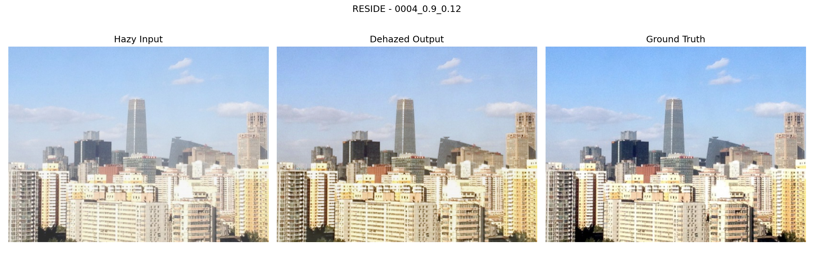
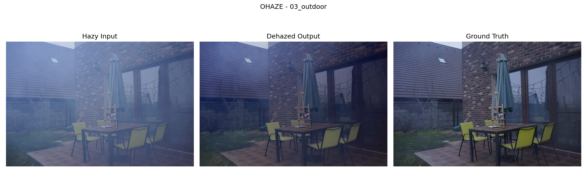

# Result Explanation

## 1. Dataset Used, Rationale, and Input Size

### Datasets used in this project

1. RESIDE-6K
- Location used in the project: archive/RESIDE-6K
- Used folders:
  - Training: train/hazy and train/GT
  - Evaluation: test/hazy and test/GT
- Role in pipeline:
  - Main supervised training dataset for baseline model learning
  - Baseline quantitative evaluation dataset

2. O-HAZY
- Location used in the project: o-haze/O-HAZY
- Used folders:
  - hazy and GT
- Role in pipeline:
  - Additional evaluation split
  - Fine-tuning dataset in the O-HAZY adaptation stage

### Why these datasets were used

- RESIDE-6K provides paired hazy and clear images, which is required by the implemented supervised loss functions (L1, SSIM, edge, depth-regularization, and atmospheric consistency).
- O-HAZY provides an additional paired set with different haze characteristics, allowing direct measurement of cross-dataset behavior and a dedicated fine-tuning stage.
- Both datasets are integrated in the implemented scripts for training, evaluation, and result packaging.

### Input image size used by the system

The implemented configuration uses image_size = 384 for model training and evaluation transforms, but the original datasets are not uniformly 384 x 384.

### Original image sizes in this workspace (measured from dataset folders)

| Dataset folder | Image count | Minimum size | Maximum size | Mean size |
|---|---:|---:|---:|---:|
| archive/RESIDE-6K/train/hazy | 6000 | 400 x 400 | 400 x 400 | 400.0 x 400.0 |
| archive/RESIDE-6K/train/GT | 6000 | 400 x 400 | 400 x 400 | 400.0 x 400.0 |
| archive/RESIDE-6K/test/hazy | 1000 | 540 x 308 | 620 x 972 | 584.0 x 468.1 |
| archive/RESIDE-6K/test/GT | 1000 | 540 x 308 | 620 x 972 | 584.0 x 468.1 |
| o-haze/O-HAZY/hazy | 45 | 1286 x 947 | 5456 x 3632 | 3626.2 x 3078.5 |
| o-haze/O-HAZY/GT | 45 | 1286 x 947 | 5456 x 3632 | 3626.2 x 3078.5 |

This confirms that O-HAZY images are much larger than the training input size, and RESIDE test images are also larger than 384 in at least one dimension.

### Exact transform behavior used in code

1. Training transform (train_transform)
- If min(height, width) < 384, image is resized first.
- A joint random crop of 384 x 384 is then applied to hazy image, GT image, and depth map using identical crop coordinates.
- Random horizontal flip is applied with probability 0.5, consistently across hazy, GT, and depth.
- RGB is converted to tensor and depth is clamped to [0, 1].

2. Validation/evaluation transform (val_transform)
- Hazy and GT are deterministically resized to 384 x 384.
- Depth is bilinearly interpolated to 384 x 384.
- Depth is clamped to [0, 1].

### Dataset-wise interpretation of the transform path

1. RESIDE train split
- Original size is fixed at 400 x 400.
- Since min dimension is already >= 384, no pre-resize is triggered.
- Effective training input is a random 384 x 384 crop from each 400 x 400 pair.

2. RESIDE test split
- Original sizes vary (540 x 308 to 620 x 972).
- For validation/evaluation, every image is resized to 384 x 384.
- This gives a fixed tensor size for metric computation and batching.

3. O-HAZY split (evaluation)
- Original sizes are high-resolution (up to 5456 x 3632).
- In evaluation scripts that use the dataset loader, images are resized to 384 x 384 before model forward pass.

4. O-HAZY split (fine-tuning training mode)
- Fine-tuning training uses train_transform with random 384 x 384 crops.
- Since O-HAZY images are far larger than 384, the model learns from random local patches extracted from high-resolution inputs.

5. Single-image inference and packaging sample inference
- Hazy image is processed at source resolution in inference scripts.
- Depth map is resized to match the current hazy image resolution before fusion.
- This path is used for generated qualitative outputs saved in the final bundles.

### Why this resizing/cropping strategy is used

- It standardizes tensor dimensions for stable batching and GPU memory control during supervised training and evaluation.
- It keeps the training objective and optimization consistent across datasets with very different native resolutions.
- It allows two modes in the same project:
  - fixed-size supervised learning/evaluation at 384 x 384
  - source-resolution qualitative inference outputs for visual inspection

## 2. Models Used, Purpose, and Working Principle

### 2.1 MiDaS depth estimator

Purpose:
- Generate monocular depth maps for each hazy image before supervised dehazing training.

Where used:
- Depth precompute script
- Optional on-the-fly depth in single-image inference

How it works in this project:
- A pretrained MiDaS model is loaded through torch hub.
- Each RGB image is transformed and passed through MiDaS.
- Output depth is upsampled to image size and min-max normalized to [0, 1].
- Depth is saved as 16-bit PNG cache for efficient reuse.

### 2.2 DepthGuidedAODNet (main dehazing model)

Purpose:
- Predict dehazed RGB image from hazy RGB plus depth map.

Structure used:
- AODNet backbone with 4-channel input (RGB + depth)
- BetaEstimator branch for adaptive scattering coefficient

Working principle:
- Input fusion: concatenate RGB and depth into a 4-channel tensor.
- Backbone predicts an intermediate map k.
- Dehazed output is computed with the AOD formula:

$$
J = k \odot I_h - k + 1
$$

where:
- $I_h$ is hazy RGB image
- $k$ is model-estimated transform map
- $J$ is dehazed output

### 2.3 BetaEstimator

Purpose:
- Estimate image-level scattering coefficient beta for transmission modeling.

How it works in this project:
- Computes global brightness statistics from hazy RGB:
  - mean luma
  - luma standard deviation
  - mean dark-channel proxy
  - mean bright-channel proxy
- Passes these 4 features through MLP 4 -> 16 -> 1 with sigmoid
- Scales output to configured range [beta_min, beta_max] = [0.3, 2.0]

Transmission is then computed as:

$$
t = \exp(-\beta D)
$$

where $D$ is normalized depth.

### 2.4 Depth map and transmission map: meaning and role in this project

#### What the depth map is

- The depth map is a single-channel image where each pixel value represents relative scene depth estimated from the hazy RGB image.
- In this project, depth is predicted using MiDaS and then normalized to the range [0, 1].
- Higher normalized values correspond to relatively farther scene points, and lower values correspond to relatively nearer points.

Why this map is needed:
- Haze intensity is depth-dependent in atmospheric image formation, so depth provides physically meaningful guidance for where haze is expected to be stronger.
- A depth channel gives the dehazing model explicit geometric context that is not directly available from RGB alone.

How it is used here:
1. As a direct input to the dehazing model by concatenating with RGB as a 4-channel tensor.
2. As the depth term $D$ in transmission computation.
3. In the depth-regularization loss, where depth gradients modulate smoothness weighting of dehazed image gradients.
4. As an interpretable intermediate visualization artifact in packaged outputs.

#### What the transmission map is

- The transmission map is a single-channel map that represents how much scene radiance reaches the camera at each pixel.
- In this implementation, it is computed from estimated beta and depth:

$$
t = \exp(-\beta D)
$$

- Pixel values near 1 indicate high transmission (less attenuation), while lower values indicate stronger attenuation by haze.

Why this map is needed:
- It encodes the spatial attenuation pattern implied by depth and scattering strength.
- It provides a physically grounded bridge between estimated depth and dehazing behavior.

How it is used here:
1. It is produced during forward pass as an explicit intermediate output.
2. It is used in atmospheric consistency reconstruction:

$$
  ilde{I}_h = J \odot t + A \odot (1 - t)
$$

where $\tilde{I}_h$ is reconstructed hazy image, $J$ is dehazed output, and $A$ is estimated atmospheric light.

3. The reconstruction is compared to actual hazy input through an L1 physics loss term.
4. It is exported as a qualitative diagnostic map to verify whether attenuation structure aligns with scene content.

#### Why both maps are important together

- Depth map supplies scene geometry cues.
- Transmission map converts geometry plus scattering estimate into pixel-wise attenuation.
- Their combination lets the model use both learned restoration and physically interpretable haze modeling in one pipeline.

## 3. Objective and Novelty of the Project

### Project objective

The objective is single-image dehazing using a depth-guided, physics-informed supervised pipeline. The system estimates depth from monocular input, injects depth into a dehazing network, and trains with both image-reconstruction and atmospheric-consistency constraints.

### What depth estimation means here

In this implementation, depth estimation is the process of predicting a per-pixel relative depth map from one hazy RGB image using MiDaS. This depth map is normalized and used in two ways:

1. As an additional input channel to the dehazing network
2. To compute transmission prior with adaptive beta, linking scene depth to haze attenuation

### Novelty in this implementation

The implemented novelty is the integration of:

1. RGB + depth fused AOD-Net backbone
2. Adaptive beta estimation from image brightness statistics
3. Explicit transmission prior computation $t = e^{-\beta D}$
4. Composite training objective that combines:
- pixel fidelity
- structural similarity
- edge consistency
- depth-aware regularization
- atmospheric reconstruction consistency

This combination directly couples learned dehazing with depth-driven atmospheric modeling in one training/inference pipeline.

## 4. Full Quantitative and Qualitative Analysis

### 4.1 Evaluation metrics used and why

1. PSNR (Peak Signal-to-Noise Ratio)
- Why used:
  - Standard full-reference restoration metric for pixel-level fidelity
  - Higher PSNR means lower reconstruction error relative to ground truth

2. SSIM (Structural Similarity Index)
- Why used:
  - Measures structural and perceptual consistency with ground truth
  - Better reflects texture/structure retention than pixel error alone
  - Higher SSIM indicates better structural reconstruction

3. BRISQUE (No-reference quality metric)
- Why used:
  - Provides a quality score without requiring reference image in principle
  - Included by evaluation utility when available through installed PIQ API
  - Lower BRISQUE indicates better perceptual naturalness

### 4.2 Dataset-level metrics table

#### Baseline model metrics
Source: outputs/eval_metrics_full.json

| Split | PSNR | SSIM | BRISQUE |
|---|---:|---:|---:|
| RESIDE | 20.6789 | 0.8730 | 24.4387 |
| O-HAZY | 15.7868 | 0.6812 | 14.2745 |

#### O-HAZY fine-tuned model metrics
Source: outputs/eval_metrics_ohaze_finetuned.json

| Split | PSNR | SSIM | BRISQUE |
|---|---:|---:|---:|
| RESIDE | 17.6483 | 0.8201 | 27.9318 |
| O-HAZY | 18.7762 | 0.7599 | 19.3366 |

#### Baseline vs fine-tuned delta (fine-tuned minus baseline)

| Split | Delta PSNR | Delta SSIM | Delta BRISQUE |
|---|---:|---:|---:|
| RESIDE | -3.0306 | -0.0529 | +3.4931 |
| O-HAZY | +2.9894 | +0.0787 | +5.0621 |

Interpretation:
- Fine-tuning on O-HAZY improves O-HAZY PSNR and SSIM.
- Fine-tuning reduces RESIDE PSNR and SSIM, indicating domain adaptation trade-off.
- BRISQUE increases after fine-tuning on both splits in the stored results, while PSNR/SSIM improve on O-HAZY. This indicates divergence between full-reference and no-reference behavior for this run.

### 4.3 Training summary from generated reports

From bundle report outputs:

| Bundle | Epochs | Best validation point | Sample mean PSNR | Sample mean SSIM |
|---|---:|---|---:|---:|
| outputs/final_results_bundle_20260314_142906/final_report.txt | 25 | epoch 23, val_psnr 20.6819, val_ssim 0.8735 | 19.3048 | 0.7453 |
| outputs/final_results_bundle_20260314_150313/final_report.txt | 40 | epoch 40, val_psnr 18.7815, val_ssim 0.7600 | 18.9142 | 0.7603 |

### 4.4 Sample-level quantitative examples from packaged outputs

Source: outputs/final_results_bundle_20260314_150313/quantitative/sample_metrics.csv

#### RESIDE sample examples

| Sample | PSNR | SSIM | SSIM (%) |
|---|---:|---:|---:|
| 0004_0.9_0.12 | 26.1726 | 0.9638 | 96.38 |
| 0010_0.95_0.16 | 13.5896 | 0.7144 | 71.44 |
| 0016_0.8_0.08 | 23.3594 | 0.9476 | 94.76 |

#### O-HAZY sample examples

| Sample | PSNR | SSIM | SSIM (%) |
|---|---:|---:|---:|
| 03_outdoor | 22.2194 | 0.7895 | 78.95 |
| 08_outdoor | 13.9000 | 0.4722 | 47.22 |
| 12_outdoor | 19.0210 | 0.6888 | 68.88 |

Interpretation:
- RESIDE sample quality in this packaged run spans high structural quality for several scenes and lower performance in heavier haze examples.
- O-HAZY sample scores show broader spread, with moderate to high gains in some scenes and lower reconstruction quality in challenging outdoor cases.

### 4.5 Qualitative output analysis with sample panels

The packaged output includes side-by-side comparison panels (hazy, dehazed, GT), plus depth and transmission visual maps.

#### RESIDE example panel

#### O-HAZY example panel

#### Depth and transmission maps for O-HAZY sample

Qualitative observations from generated artifacts:
- Dehazed outputs generally reduce haze veil and increase edge visibility versus hazy inputs.
- Scene-dependent variation is visible across both datasets.
- Depth and transmission maps provide physically interpretable intermediate outputs corresponding to spatial haze attenuation behavior.

## 5. Parameter Explanation and Result Interpretation

### Core configured parameters used in the implemented pipeline

1. Data and training size parameters
- image_size: 384
- train_batch_size: 2
- val_batch_size: 2

2. Optimization parameters
- epochs: 25 (baseline training)
- learning rate: 0.0002
- weight decay: 0.0001
- gradient clipping max norm: 1.0
- AMP: disabled

3. Atmospheric parameters
- beta_min: 0.3
- beta_max: 2.0

4. Composite loss weights
- l1_weight: 1.0
- ssim_weight: 0.3
- edge_weight: 0.2
- depth_reg_weight: 0.1
- physics_weight: 0.2

### How these parameters connect to observed results

- The combined objective prioritizes pixel fidelity while preserving structure and edges and enforcing physics consistency.
- O-HAZY fine-tuning shifts model behavior toward O-HAZY characteristics, improving O-HAZY PSNR/SSIM while reducing RESIDE PSNR/SSIM.
- Sample-level spread in both datasets shows scene-specific sensitivity, consistent with haze density and illumination variation captured in the depth-guided transmission process.

## 6. End-to-End Summary

The implemented project is a complete depth-guided dehazing workflow:

1. Build paired hazy-clean-depth samples using RESIDE-6K and O-HAZY.
2. Precompute normalized depth maps via MiDaS and store as 16-bit depth cache.
3. Train DepthGuidedAODNet with composite supervised and physics-informed loss.
4. Evaluate with PSNR, SSIM, and available no-reference quality metrics.
5. Fine-tune on O-HAZY and re-evaluate.
6. Package quantitative tables and qualitative outputs (comparison panels, dehazed outputs, depth maps, transmission maps).

This result explanation is based directly on the implemented code, configuration, and generated output artifacts present in the workspace.